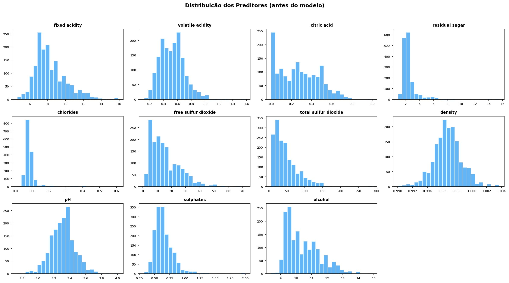
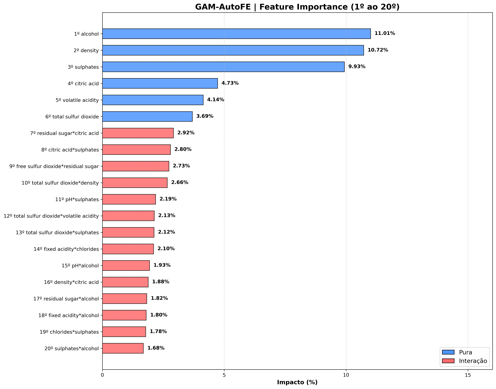
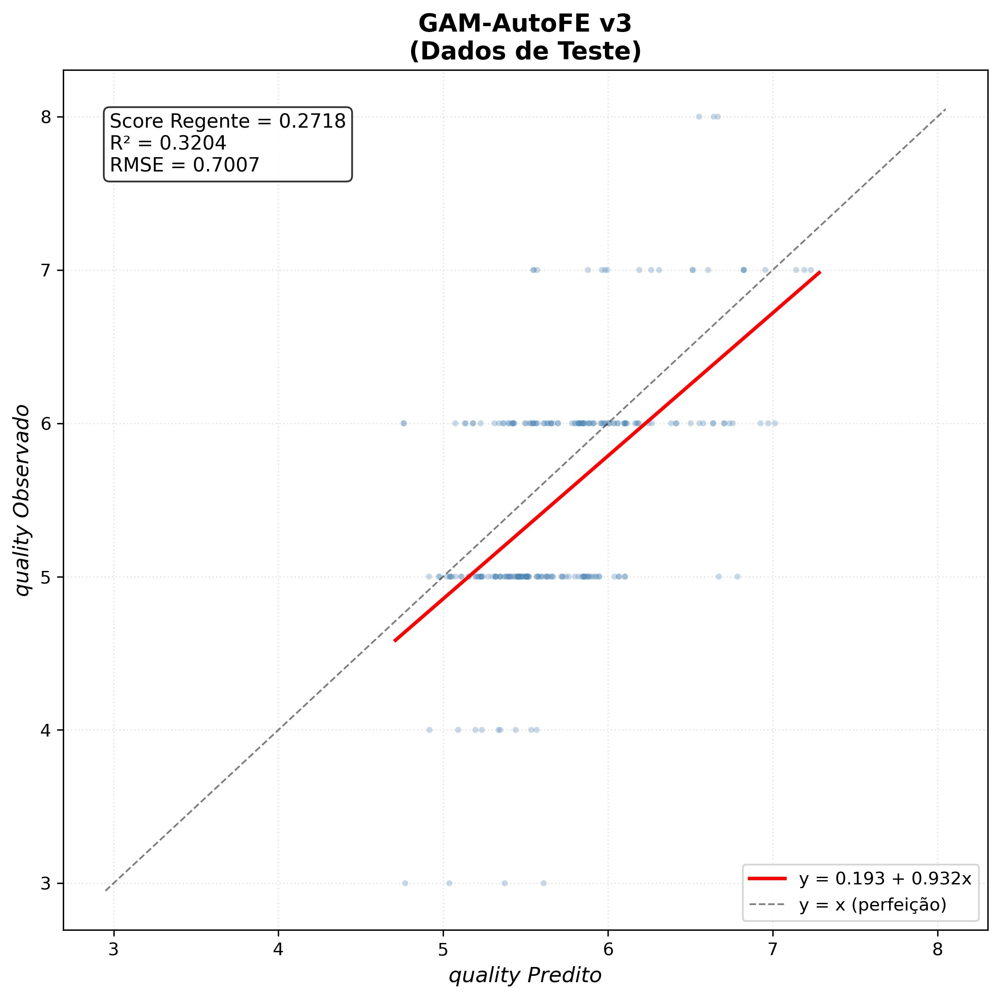

# 🍷 Red Wine Quality — What Governs the Sensory Score?

### An Interpretable AI Model That Discovers the Equation Behind Wine Quality

> *Wine quality is not a mystery. It's an equation — and now we have that equation.*

---

## 📋 Overview

This project analyzes **1,599 Portuguese red wine samples** to discover which physicochemical properties govern the sensory quality score (0–10) assigned by expert panels.

Using a proprietary **XAI-AutoML** (Explainable AI + Automated Machine Learning) framework, we built a fully transparent predictive model that:

- Discovers the **explicit mathematical equation** governing wine quality
- Identifies **59 predictive components** (11 pure variables + 48 interactions)
- Delivers **exact percentage importance** for every factor
- Achieves **competitive performance** against 9 industry-standard black-box models
- Passes **36 automated integrity tests** with zero failures

**This project was developed as part of the Pós Tech FIAP AI Scientist program (Challenge 3 — Phase 1).**

---

## 🏆 Key Results

### Benchmark — Top 3 Among 10 Models

```
 #   Model                  Type          Score    R²       RMSE
 1.  GradientBoosting       Black box     0.2927   0.3396   0.6728
 2.  CatBoost               Black box     0.2722   0.3147   0.6867
 3.  Our Model (XAI-AutoML) Transparent   0.2718   0.3204   0.7007
 4.  ExtraTrees             Black box     0.2636   0.2885   0.6951
 5.  RandomForest           Black box     0.2634   0.2833   0.6995
 6.  LightGBM               Black box     0.2500   0.2803   0.7059
 7.  HistGradientBoosting   Black box     0.2350   0.2665   0.7091
 8.  XGBoost                Black box     0.2267   0.2471   0.7221
 9.  Poly Regression (G3)   Transparent  -0.5082   0.0284   1.7975
```

**The cost of transparency:** The gap to the leader (GradientBoosting) is just 0.021 in score — equivalent to 0.03 points of RMSE. No enologist would make a different decision based on 0.03 points. But the difference in explainability is total.

### Validation

- **36/36 automated tests passed** (model integrity, prediction coherence, numerical robustness)
- **A/B simulation** confirmed that wine chemistry is a coupled system — the equation is most powerful as a scenario simulator, not an automated intervention engine

---

## 🔍 Top Findings

### The Three Levers of Quality

| Factor | Importance | Relationship | Business Insight |
|--------|-----------|-------------|-----------------|
| **Alcohol** | 11.0% | Nearly linear | More alcohol → higher quality. Target: >11% vol. |
| **Density** | 10.7% | Sublinear | Lighter wines score higher. Fermentation thermometer. |
| **Sulphates** | 9.9% | Nearly linear | Optimal range: 0.6–0.9 g/dm³. Cents per liter. |

These three factors concentrate **31.7%** of all quality variation — the primary levers.

### The Dangerous One

**Volatile acidity (4.1%)** has a **quadratic** relationship — the damage accelerates. The difference between 0.5 and 0.8 g/dm³ is not 60%; it's **2.5x** in impact. Non-negotiable limit: below 0.40 g/dm³.

### The Hidden Discovery

**Residual sugar** has a Pearson correlation of just +0.014 with quality — essentially zero. But its interaction with **citric acid** is the strongest combined effect in the model (2.92%, ranked 7th). Gustatory balance is measurable and optimizable. A correlation-only approach would have missed this entirely.

### 48 Interactions Detected

The model found 48 statistically significant interactions between variables — chemical synergies and antagonisms that traditional linear analyses cannot capture.

---

## 📊 Figures

### Exploratory Data Analysis


*Distribution of the 11 physicochemical predictors before modeling.*

### Feature Importance


*Top 20 components by importance (blue = pure variables, pink = interactions).*

### Predicted vs Observed


*Scatter plot on test data: Score = 0.2718, R² = 0.3204, RMSE = 0.7007.*

---

## 💰 Estimated ROI

For a winery producing 100,000 bottles/year:

- **Revenue uplift:** Elevating from "table" (€5/bottle) to "reserve" (€7/bottle) = **€200,000/year**
- **Intervention cost:** Temperature control, yeast selection, acidity monitoring < **€20,000/year**
- **ROI: 10:1**

Best marginal ROI: **volatile acidity control** (15:1) — cheapest intervention, quadratic impact.

---

## 🧪 Model Validation Summary

```
36 passed, 0 failed — 36 total

Categories:
  ✅ Model Loading .............. 6 tests
  ✅ Variables .................. 2 tests
  ✅ Prediction ................. 7 tests
  ✅ Scoring Metric ............. 5 tests
  ✅ Mathematical Transforms .... 4 tests
  ✅ Optimizer & VIF ............ 6 tests
  ✅ Robustness ................. 6 tests
```

All reference values are **derived from the data itself** — no hardcoded parameters. The same test suite works with any dataset, in any domain.

---

## 📂 Repository Structure

```
wine-quality-xai-automl/
├── README.md                  # This file
├── figures/
│   ├── eda_distributions.png  # EDA histograms
│   ├── feature_importance.png # Top 20 feature importance
│   └── predicted_vs_observed.png # Scatter plot (test data)
├── results/
│   ├── benchmark.txt          # Full benchmark results
│   ├── test_results.txt       # 36/36 test summary
│   └── ab_test_results.txt    # A/B simulation results
└── LICENSE
```

> **Note:** The model source code is proprietary and not included in this repository. This repo contains results, figures, and documentation only. For inquiries about the XAI-AutoML framework, please contact the author.

---

## 📖 Dataset

**Source:** [UCI Machine Learning Repository — Wine Quality](https://archive.ics.uci.edu/ml/datasets/wine+quality)

**Citation:** P. Cortez, A. Cerdeira, F. Almeida, T. Matos and J. Reis. *Modeling wine preferences by data mining from physicochemical properties.* In Decision Support Systems, Elsevier, 47(4):547–553, 2009.

---

## 🔧 Technical Stack

- **Language:** Python
- **Computation:** NumPy, SciPy, CuPy (GPU acceleration)
- **Visualization:** Matplotlib
- **Model Category:** XAI-AutoML (Explainable AI + Automated Machine Learning)
- **GPU Speedup:** ~43x (CPU: 12.1s → GPU: 0.28s)

> **Key differentiator:** Zero external hyperparameter tuning required. The framework optimizes its own architecture internally — no GridSearch, no Optuna, no manual configuration. Point it at a CSV and run.

---

## ✍️ Author

**Rafael Maia Frenhe**
- Meteorologist — IAG-USP (2013)
- M.Sc. Student — Energy Engineering in Agriculture, UNIOESTE
- Postgraduate — AI Scientist, FIAP
- Founder & CEO — [Climática Consultoria](https://www.linkedin.com/in/rafaelmaia-79824852)

---

## 👥 Team

- Rafael Maia Frenhe
- Ana Beatriz Porto Pereira
- Felipe Nadal de Oliveira
- Cristiane Marina de Oliveira
- Leonardo Neves de Carvalho

---

## 📄 License

This project's results and documentation are shared for educational purposes. The underlying model and source code are proprietary. See [LICENSE](LICENSE) for details.

---

## 🏷️ Tags

`Machine Learning` `Explainable AI` `XAI` `AutoML` `Wine Quality` `Regression` `Data Science` `Feature Engineering` `GPU Computing` `Python`
